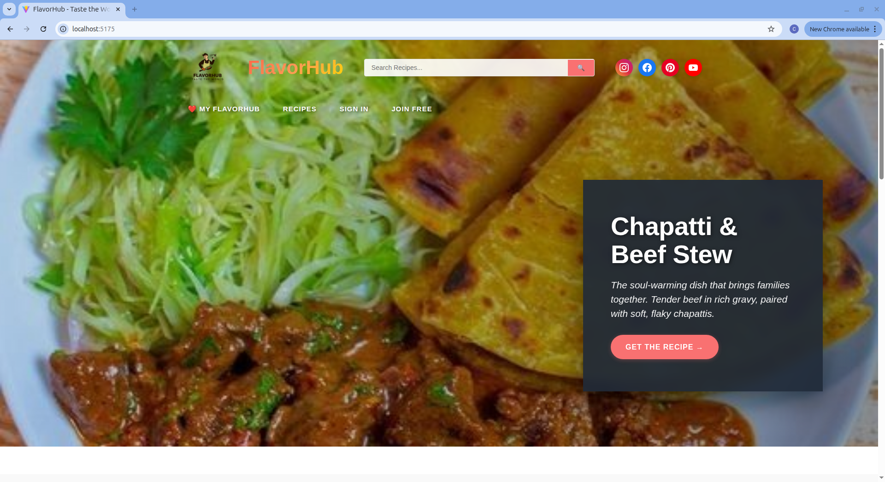
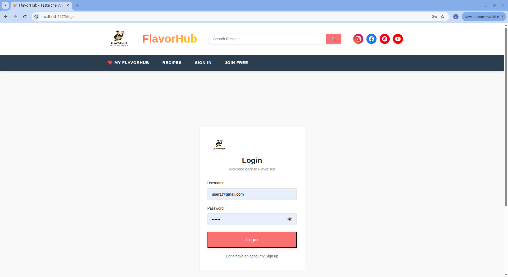
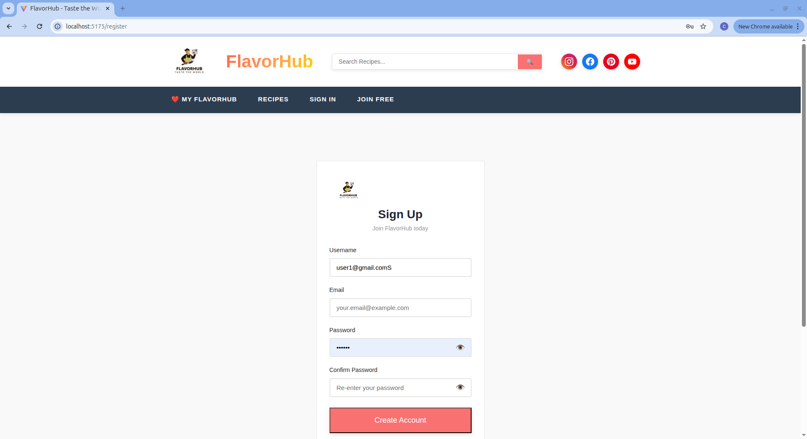
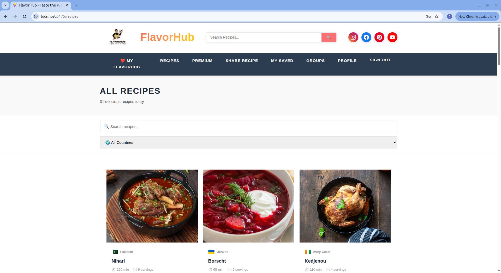
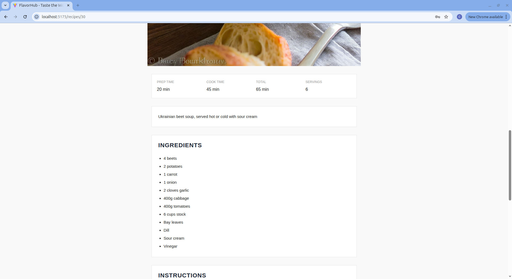
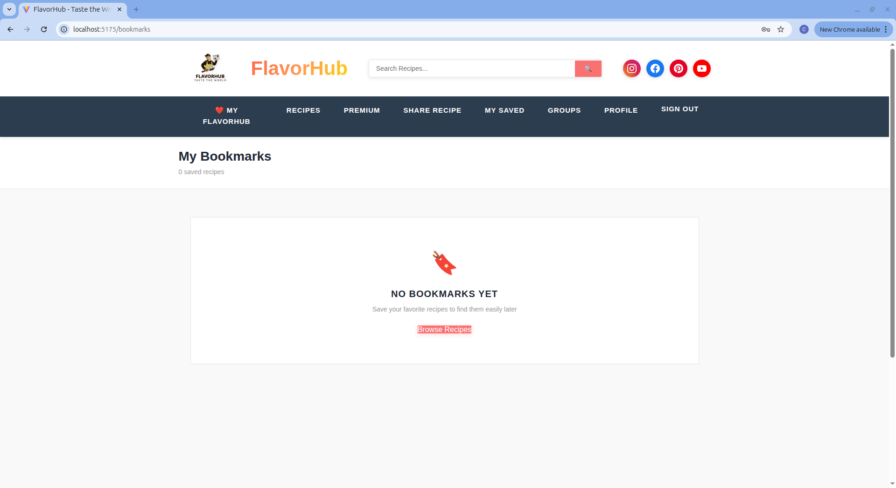
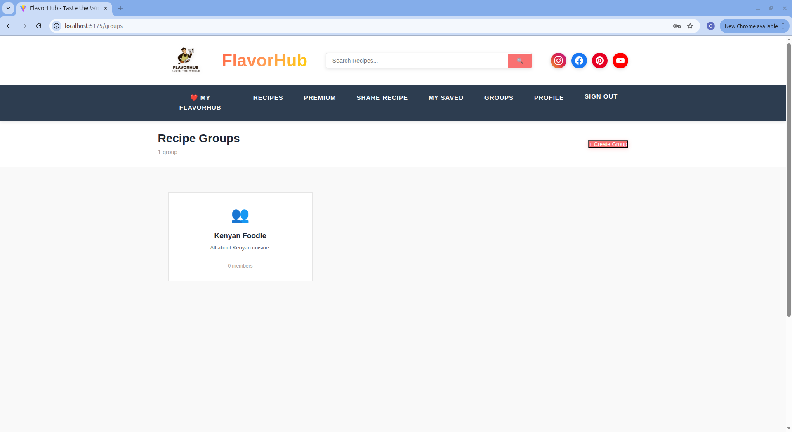
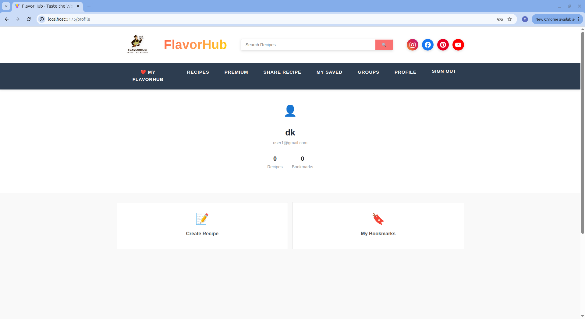

# FlavorHub - Frontend

React + Vite frontend for FlavorHub recipe sharing platform.



## Screenshots

### Homepage


### Login


### Register


### Recipe Browser


### Recipe Details


### Bookmarks


### Groups


### User Profile


## Tech Stack

- React 18
- Vite
- Redux Toolkit
- React Router
- Axios
- CSS3

## Quick Start

```bash
# Install dependencies
npm install

# Setup environment
cp .env.example .env
# Edit .env: VITE_API_BASE_URL=http://localhost:5000/api

# Run dev server
npm run dev
```

Frontend runs on `http://localhost:5173`

## Project Structure

```
src/
├── components/      # Reusable components
│   ├── BookmarkButton.jsx
│   ├── FilterPanel.jsx
│   └── RecipeCard.jsx
├── pages/          # Page components
│   ├── Home.jsx
│   ├── Login.jsx
│   ├── Register.jsx
│   ├── RecipesPage.jsx
│   ├── RecipeDetail.jsx
│   ├── Bookmarks.jsx
│   ├── Groups.jsx
│   └── Profile.jsx
├── services/       # API services
│   ├── authService.js
│   ├── recipeService.js
│   └── groupService.js
├── store/          # Redux store
│   └── authSlice.js
├── utils/          # Helper functions
│   └── countryFlags.js
├── config/
│   └── api.config.js
├── App.jsx
└── main.jsx
```

## Features

- 🌍 Browse 100+ recipes from 25 countries
- 🔍 Search and filter recipes
- 🔖 Bookmark favorite recipes
- ⭐ Rate and comment on recipes
- 👥 Create and join cooking groups
- 🔐 JWT authentication
- 📱 Fully responsive design

## Environment Variables

```bash
VITE_API_BASE_URL=http://localhost:5000/api
VITE_PAYD_PUBLIC_KEY=your-payd-public-key
```

## Available Scripts

```bash
npm run dev          # Start development server
npm run build        # Build for production
npm run preview      # Preview production build
npm run lint         # Run ESLint
```

## API Integration

All API calls use centralized configuration in `src/config/api.config.js`.

```javascript
import { API_BASE_URL, API_ENDPOINTS } from '../config/api.config';
```

## Build for Production

```bash
npm run build
```

Output in `dist/` directory.

## Deployment

### Vercel
1. Push to GitHub
2. Import project in Vercel
3. Set build command: `npm run build`
4. Set output directory: `dist`
5. Add environment variables
6. Deploy

### Netlify
1. Push to GitHub
2. New site from Git
3. Build command: `npm run build`
4. Publish directory: `dist`
5. Add environment variables
6. Deploy

## Author

Built by Derrick Koome
